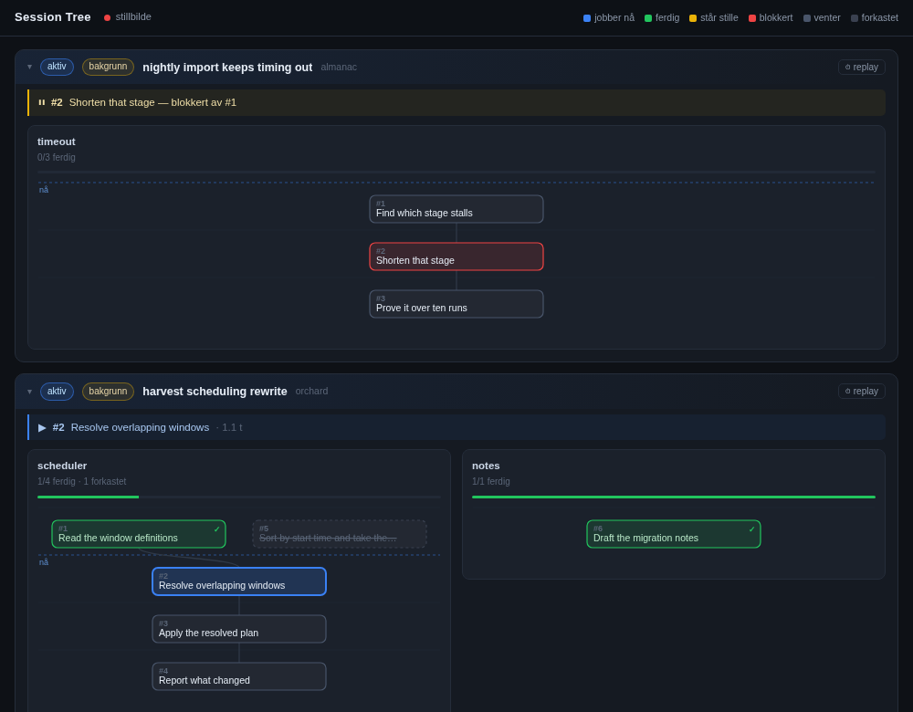

# session-tree

A live picture of what your coding agents are doing — Claude Code and Codex, in
this session and in every other one on your machine, across every project — in
its own window, beside the terminal.



*Synthetic sessions. Red is blocked by an open dependency, blue is being worked
now, green is done, and the struck-through node is a branch that was tried and
dropped.*

Each session's work is drawn as a task graph. Nodes go blue while worked, green
when done, amber when nothing has moved, red when blocked, and struck through
when a branch was tried and dropped. A slider walks any session back through
its own history, with your own prompts on the timeline, so what happened and
why is recoverable hours later.

## The problem it solves

An agent session is a scroll. Twenty minutes in, the plan is above the fold and
the reason for it is further up still. Several sessions at once, and there is no
place at all that says what is in flight. You end up asking the agent what it is
doing, which is the question the tool should already be answering.

## Getting started

<!-- not run: starts a background server and opens a browser window -->
```bash
uv tool install session-tree      # or: pipx install session-tree
session-tree open                 # own window, live
```

Leave the window open. It updates itself as the work happens; there is nothing
to refresh and nothing to rebuild.

The same picture in the terminal, and what it says when nothing is serving:

```console
$ session-tree --port 9099 status
not running (start it with: session-tree start)
```

## How it works

What each agent already writes, so **no hook has to be installed and nothing
can be forgotten**:

| Source | What it gives |
|---|---|
| `~/.claude/sessions/<pid>.json` | every live Claude Code session: id, directory, name, status |
| `~/.claude/projects/<slug>/<session>.jsonl` | its transcript, appended as it happens |
| `~/.codex/state_*.sqlite` | every Codex thread: id, directory, title, timestamps |
| `~/.codex/thread_history_*.sqlite` | its turns, with status and duration, and what each one changed |

The Codex filenames carry a schema version that moves when it upgrades, so the
newest match is read rather than a fixed name.

`TaskCreate` and `TaskUpdate` calls in the transcript replay into nodes and
edges. Because the source is the transcript rather than a hook, the view works
backwards too: a session that ran last week still draws, and a session that had
never heard of this tool appears anyway.

Transcripts reach tens of megabytes, so each is read forward from a remembered
byte offset and never re-parsed. A change reaches an open window in about a
hundredth of a second.

## One graph on its own

A goal card shows its graph at the width the card has. Click the goal's title
and the same graph opens alone, filling the window, drawn live like the card.
There the mouse wheel zooms around the pointer, a drag pans, a double-click
fits the whole graph again, and Esc or the ✕ closes it. A graph of a hundred
nodes is readable that way, and still updates while it is open.

## On your phone

The page fits a phone: one goal at a time, thumb-sized buttons, and the
focused graph pinches to zoom. When a session has more than one independent
goal, a pager shows one decomposition at a time — swipe left or right, tap a
dot, or use the arrow keys on a keyboard; "alle" shows every goal at once
again. The page you were on is remembered per session.

The server listens on localhost only. To reach it from a phone, bind it to
your [Tailscale](https://tailscale.com) address instead, so that only devices
on your own tailnet can connect:

<!-- not run: binds a server to this machine's tailnet address -->
```bash
SESSION_TREE_HOST=$(tailscale ip -4) session-tree start
```

Then open `http://<that address>:8787/` on the phone. `--host` does the same
from the command line. **There is no authentication**: the page shows every
session's prompts and file paths to whoever can reach it, so bind it to the
tailnet address only, never to `0.0.0.0` on a network you share.

## Codex

Codex records turns, not tasks. A thread is drawn as a band of turns along time
— coloured by status, sized by duration, carrying which files each turn changed
and which commands exited non-zero.

It does have a checklist tool, `update_plan`, but three things stand in the way
and none of them is on by default: the tool's config defaults to off, the call
is never kept as a thread item so it exists only inside the rollout file, and
the checklist has no edges — each step is a string and a status, with no
identifier and nothing to point at.

<!-- not run: writes into ~/.codex and needs Codex restarted afterwards -->
```bash
session-tree install-codex-hook
```

That turns the tool on, registers a `PostToolUse` hook that catches every plan
as it is written, and adds a note to `AGENTS.md` asking the model to put the
dependencies in the explanation:

    deps: 2<-1; 3<-2; 4<-2

Nothing is overwritten — an existing file is backed up first, and a block that
is already there is left alone.

**Codex will not run a newly configured hook until it is trusted.** Start
`codex` once afterwards and approve it when asked; the answer is remembered.
Until then the plan is never captured and nothing says why. For automation,
`codex exec --dangerously-bypass-hook-trust` skips the check for one run.

Those edges are text a model wrote, not a field anything validated, so an edge
pointing at a step that does not exist is **shown on the card** rather than
quietly dropped. A plan with no dependencies at all says so too, because
listing steps in an order is not the same as one waiting for another.

## What is not automatic

**The graph is the agent's decomposition. Nothing else supplies it.** A Claude
Code session that never calls `TaskCreate` shows up as a card with no picture —
correctly, because nothing knows what it was trying to do.

The accompanying skill (`SKILL.md`, for `~/.claude/skills/`) is what teaches the
agent to decompose before starting, wire real `blockedBy` dependencies, put
separate goals on separate graphs, and leave abandoned branches on the picture
instead of deleting them.

One state is inferred rather than reported: a node in progress whose transcript
has been silent for fifteen minutes goes amber on its own. It is the only state
that cannot be faked by forgetting to update a task, which is why it is there.

## Subagents, and what a session needs from you

A node that spawned subagents carries them inside it, one line each, blue while
running and green when done — so a step that fanned out into a six-seat review
panel looks like one, without being opened.

Agents started before the work was decomposed at all belong to the session
rather than to a node. A review panel usually is one: the seats run, and the
tasks are created from what they found. Hanging them under whichever node
happened to be open would invent a tie that is not there.

Each session header says what it needs from a person. `venter på deg` means the
agent is idle with the process alive — it has answered and is waiting. `står
stille` means the session claims to be busy while nothing has been written for
fifteen minutes, which is the one case where going in and looking is worth
doing.

## Replay

`⏱ replay` on a session header turns the graph into a recording of itself. The
slider is linear in time, so the gaps show where the thinking went; playback
steps event by event, because a real-time replay of a forty-minute session takes
forty minutes.

Your own prompts sit on the timeline in green beside the node changes. That is
the point of it: a node turning green tells you *what* happened, and the prompt
three ticks earlier tells you *why*.

## Development

The server is shared by every window, so stopping it interrupts nobody:

<!-- not run: starts and stops a background server -->
```bash
session-tree start      # server only, no window
session-tree restart    # after upgrading the package
session-tree stop
```

<!-- not run: the suite is what this command runs; running it here would nest -->
```bash
uv sync --all-extras
uv run pytest -q
uv run ruff check . && uv run mypy src
python scripts/mutate.py          # proves each rule's test can fail
```

The replay engine lives in the page, and its tests run *that* copy through
node rather than a Python port, so the thing tested is the thing shipped.

## Licence

Apache-2.0. See [LICENSE](LICENSE).
